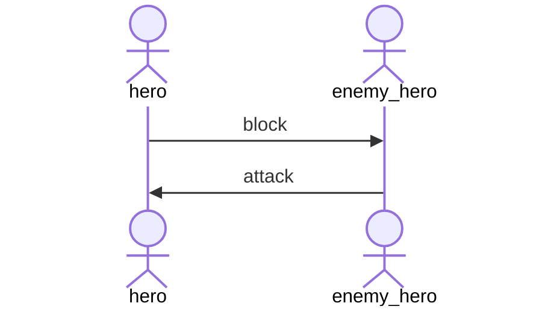

# VA Card Game Manual

#### Number of players: 2
#### Age recommendation: 13+
#### Playing time: approx. 20 minutes

## Deck:

The game requires 2 decks of 15 cards each.

#### Deck structure:

Hero deck:
- 15 unique cards

Equipment deck:
- 7 duplicate cards
- 1 super equipment

You can use a pre-constructed deck or create your own version.

## Basic Rules

1. Each player starts the game with 5 life points.

2. You can play only one hero card on the battlefield.

3. You can attach maximum 3 equipment cards to your hero.

## Start of the game:

1. You decide who will start the game by flipping a coin. 

2. All player draws 3 cards from each of his 2 prepared decks. 

3. Both players place on the battlefield one hero card face down, and they can also attach to the hero equipments cards also face down.

4. When both players finished preparing their face down cards, then they need to declare they are ready.

5. After the declaration, both player needs to reveal their cards on the battlefield.

6. The player who won the coin flip starts now the turn.

## Turn:

1. Player needs to declare attack or block now.

2. Now, the enemy player also needs to declare attack or block.  

Now we can have 3 situations:

Each of the heroes permanently loses as many "HP" points as the opponent had "AD".
If the hero's "HP" drops below 0, he leaves the battlefield together with equipment to a separate pile (graveyard).
The players whose character died loses 1 life point.

The attacking hero use "AD". The defending hero adds the "DEF" value to his hero's "HP". 
Now we remove permanently the value of "AD" from blocking hero "DEF". In case the "AD" value is bigger than "DEF", then we remove the rest of the value from the blocking hero "HP".
When the blocking hero's "HP" drops below 0, the same rule applies as in the case of attack-attack.

In this situation, if any condition didn't trigger then none of the heroes lose any statistics, and we go to the next step of the turn.

3. You now draw one card from each of your 2 decks.

4. You can add now more equipment to your hero. In case that your hero dies, then you can also put a new hero on the battlefield. In the special situation where you don't have a hero card in your hand, you may draw one now.

5. Repeat the last step also for the enemy hero.

6. End of the turn. Now enemy starts the turn.

## End of the game:

The game ends if:

- One player loses all life points. The player who survives wins the game.

- One player loses all of his hero cards. Then the player with the most life points wins the game.
